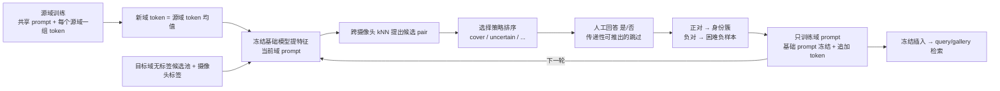

# FERReID：主动 pair 查询的目标域 prompt 适配

**Active pair querying for target-domain prompt adaptation in person ReID**

在源域训练基础模型（DINOv2 + VPT，**每个源域一组追加 token**，共享 prompt 与 LoRA 学跨域通用的部分）；部署到新的摄像头网络时，基础参数全部冻结，为新域追加一组 token（初始化为源域 token 的均值），模型从无标签候选池中提出"可能是同一个人"的跨摄像头图像对，人只回答"是 / 否"；正对聚成身份簇，负对成为困难负样本；据此训练这组 token，学完冻结插入，成为该域的常参数。目标是用最少的人工回答把模型迁移到新域。

**协议**：Market-1501 / MSMT17 / CUHK03 / CUHK-SYSU 留一，三折，Market、MSMT17、CUHK03 分别作目标域（CUHK-SYSU 只作源域）；源域只用 train 划分；目标域与源域完全分开，目标域只提供无标签候选池（train 划分）、主动查询的人工回答，以及评测用的 query/gallery。

> 本分支 `Active_Pair_Prompt` 由 `Direction_A_contrast_distill` 精简而来：保留数据读取、DINOv2/ViT 主干、VPT/plain 基础模型训练、原版 VICP（in-context 对照）和锚点图选择器；新增多域 token 训练与主动查询模块。方向 A（残差 prompt、对比损失、蒸馏）、小数据集（VIPeR/GRID/i-LIDS）、上下文诊断脚本和历史结果归档留在原分支。

## 导航

- [方法、协议、输出与判读](docs/ACTIVE_PROMPT.md)
- [簇修复：伪标签 + 主动合并/拆分查询（本分支主线）](docs/CLUSTER_REPAIR.md)
- [环境安装、数据与权重准备、运行](docs/DEPLOYMENT.md)
- [代码来源与第三方说明](THIRD_PARTY_NOTICES.md)

## 方法概览



| 组件 | 配置 |
|---|---|
| 基础模型 | `--model_type vpt --source_domain_tokens 8`：DINOv2 ViT-B/14（252×126）；最后 4 层 LoRA r=128；每层 32 个共享 prompt token + 每个源域 8 个 token（单域 batch 用本域 token）；triplet + BNNeck/ID + WPA |
| 候选 pair | 每张图在其他摄像头中的 10 个近邻（无摄像头的域用任意其他图） |
| 选择策略 | `cover`（本方法）、`uncertain`、`balanced`、`confident`、`random`；ID 级对照 `anchor:<选择器>`；上界 `oracle_all` |
| 约束 | union-find 正簇 + 簇间 cannot-link，传递性推断 |
| 域 prompt | `append`：共享 prompt 不动，每层追加 8 个 token，初始化为源域 token 均值；`replace`：调默认 prompt 的副本；300 步，lr 3e-4（由 `plans/tune.tasks` 在 CUHK-SYSU 上重选） |
| 对照 | VICP（LLM + 上下文，Qwen3-0.6B）、plain、全量标注上界 |

## 数据集

| 数据集 | 角色 | train（人 / 图） | query | gallery | 摄像头 |
|---|---|---:|---:|---:|---:|
| Market-1501 | 折 1 目标；折 2、3 源域 | 751 / 12,936 | 750 / 3,368 | 751 / 15,913 | 6 |
| MSMT17 V1 | 折 2 目标；折 1、3 源域 | 1,041 / 30,248 | 3,060 / 11,659 | 3,060 / 82,161 | 15 |
| CUHK03-NP labeled | 折 3 目标；折 1、2 源域 | 767 / 7,368 | 700 / 1,400 | 700 / 5,328 | 2（每对） |
| CUHK-SYSU（ReID 裁剪版） | 三折都是源域 | 文献值 5,532 / 15,088 | 2,900 / 2,900 | 2,900 / 5,447 | 无 |

| 折 | 源域（train 划分） | 目标域 |
|---|---|---|
| 1 | MSMT17 + CUHK03 + CUHK-SYSU | Market-1501 |
| 2 | Market-1501 + CUHK03 + CUHK-SYSU | MSMT17 |
| 3 | Market-1501 + MSMT17 + CUHK-SYSU | CUHK03 |

- 路径均相对 `FERREID_DATA_ROOT`，目录结构见 [部署文档](docs/DEPLOYMENT.md)；`python scripts/check_datasets.py` 核对规模（CUHK-SYSU 以实际输出为准）。
- 目标域的 train 划分只作无标签候选池；query/gallery 只用于评测；代码检查二者路径不重叠。
- 主动模块的超参数在一个不涉及三个目标域评测的折上选：Market + MSMT17 训练的基础模型适配到 CUHK-SYSU（`plans/tune.tasks`）。

## 快速开始

```bash
cp configs/paths.example.sh configs/local.sh && source configs/local.sh   # 编辑路径后加载
python scripts/check_datasets.py
python tests/test_active.py && python tests/test_trainer.py              # CPU 自检，无需数据和权重

python scripts/launch_tasks.py plans/base.tasks --gpus 0,1,2,3           # 三折基础模型（多域 token / 单 prompt / VICP）
python scripts/launch_tasks.py plans/tune.tasks --gpus 0,1,2,3           # 在 CUHK-SYSU 上选主动模块的 lr / 步数
python scripts/launch_tasks.py plans/diag.tasks --gpus 0,1,2             # 诊断：基础模型能否提出有用的 pair
python scripts/launch_tasks.py plans/active.tasks --gpus 0,1,2,3         # 主表、消融、in-context 对照
python scripts/launch_tasks.py plans/pilot.tasks --gpus 0,1,2,3,4                     # 簇修复：单折试验（CUHK03，约 3 小时，先跑这个）
python scripts/launch_tasks.py plans/sim.tasks plans/repair_tune.tasks --gpus 0,1,2,3   # 簇修复：离线筛选、调参
python scripts/launch_tasks.py plans/repair.tasks --gpus 0,1,2,3,4,5,6,7               # 簇修复：三折主表与消融
```

参数见 `adapters/args_reid.py`（模型与训练）和 `scripts/eval_active.py`（主动模块）。

## 目录

```text
adapters/
  active/           主动查询模块：图像存储（缓存/流式）、候选 pair、约束、选择策略、域 prompt 训练、轮次循环；
                    pseudo.py（伪标签聚类 + 约束）、repair.py（合并/拆分问题与排序）
  baseline_model.py VPT（含多域 token）/ plain 基础模型，checkpoint 加载
  vicp_model.py     原版 VICP（in-context 对照）
  backbones.py      DINOv2 / timm ViT 包装
  trainer_reid.py   基础模型训练与 in-context 评测
  context_selection.py, selectors.py   锚点图选择（label-free）与模拟标注
  reid_dataset.py, cuhk03_np.py, cuhksysu.py, config_reid.py（三折定义）, args_reid.py, reid_head.py
ops/                LoRA、triplet、WPA、deep prompt 插入
scripts/            train_reid / eval_active / diag_retrieval / diag_vlm / eval_context / 数据与权重准备 / 多卡启动器
plans/              任务清单（base / tune / diag / active）与共享设置 common.sh
tests/              CPU 自检
docs/               方法说明与部署流程
```

## 引用与代码来源

主干与上下文对照改编自 [VICP: Generalizable Object Re-Identification via Visual In-Context Prompting](https://arxiv.org/abs/2508.21222)（ICCV 2025），数据读取与评测使用 [deep-person-reid / torchreid](https://github.com/KaiyangZhou/deep-person-reid)。使用时请引用原方法和相关数据集。第三方代码版权和许可保留各自归属，详见 [来源说明](THIRD_PARTY_NOTICES.md)。本仓库暂不额外声明统一开源许可证。
