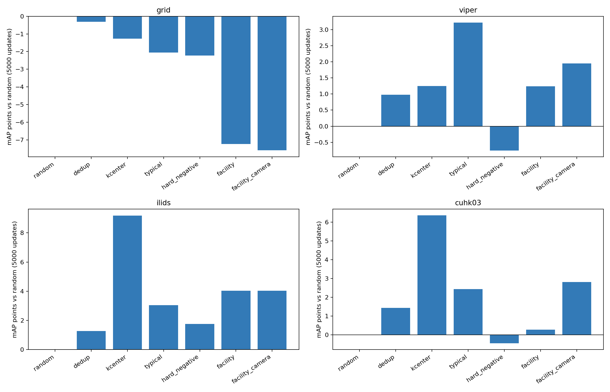

# Direction B：VPT主动选样的B1/B2实验

## 范围与结论

本分支归档已经完成的B1接入核验和B2主动选样对照。运行的是纯VPT：冻结视觉主干和LoRA，仅用目标域少量配对标注优化外部prompt。没有加载或调用LLM，没有训练方向A生成器。

**本轮是旧开发设置，不是正式P2/P3。** 基础模型来自Market1501+MSMT17的train部分，checkpoint为`experiments/s2_vpt_long/checkpoint-12000`。目标为GRID、VIPeR、iLIDS的split0和CUHK03固定500身份开发子集。不能将这些结果改名为P3；正式P3需要按四折源域全部图片重新训练对应VPT。

主要发现：没有一种选择器在四域都优于随机。VIPeR的typical取得正收益；K-center在iLIDS/CUHK03主要减少长时间适应损害；预先指定主候选facility在GRID明显劣于random。

## B1：接入和数值一致性检查

- 筛选器接收匿名索引、冻结VPT检索特征和可用摄像头信息，不接收身份标签或图片文件名。选定后才模拟获取配对标注。
- 选择、配对标注、优化随机数分离，同一anchor跨算法使用相同配对规则。
- 修正K-center重复特征/并列距离导致重复索引的边界；选择特征在FP32重新归一化。
- 四域旧随机300步实验的输入、梯度、prompt及成绩精确复现；新流程20步检查与独立重载通过。
- B1的20步成绩只验证接口，不用于选择方法优劣。首次GRID检查在归一化断言处停止，未开始该次训练；修正后在v2目录重新核验，失败记录没有当作成功结果。

[B1说明](../results/active_vpt_b1_20261002/REPORT_ZH.txt) · [B1汇总](../results/active_vpt_b1_20261002/summary.json)

## B2：固定5000步主结果

预算为16张anchor及其模拟同人配对，不保证16个不同身份；重复和失败仍消耗预算，不补选。主学习率1e-4，Adam，FP32 hardest Triplet，margin=0.1；不使用ICL或WPA。

4域×7方法×3次选样/配对重复×2个优化种子，共168个表格条件。iLIDS无真实摄像头，facility_camera与facility完全等价，复用结果，因此实际执行162次训练，共810000次更新，AMP跳步为0。所谓162次是运行数量，不是162个统计独立样本。

每组固定5000次实际更新；记录100/300/1000/3000/5000步，以5000步为主，不根据测试成绩挑选最佳checkpoint。

| 方法 | GRID | VIPeR | iLIDS | CUHK03 |
|---|---:|---:|---:|---:|
| 冻结VPT | 61.23 | 81.32 | 92.73 | 57.07 |
| random | 66.57 | 79.83 | 83.26 | 47.96 |
| dedup | 66.26 | 80.81 | 84.55 | 49.40 |
| kcenter | 65.30 | 81.08 | 92.44 | 54.32 |
| typical | 64.51 | 83.05 | 86.31 | 50.39 |
| hard_negative | 64.34 | 79.08 | 85.02 | 47.51 |
| facility | 59.33 | 81.07 | 87.29 | 48.23 |
| facility_camera | 58.98 | 81.78 | 87.29（等价复用） | 50.78 |

表中适应结果平均全部六次运行。GRID/VIPeR/iLIDS的部分facility配置只有一个独特anchor集合，不应把重复运行视作三份独立标注集。样本标准差不是跨数据集置信区间。

筛选收益应相对random计算，同时报告相对冻结VPT的变化。VIPeR typical比random高3.22点、比VPT高1.74点；iLIDS/CUHK03的kcenter虽比random高9.18/6.37点，仍低于冻结VPT。GRID随机选择最好，不能宣称组合筛选成功。

同一轮random从300到5000步的均值变化：GRID 68.42→66.57；VIPeR 82.33→79.83；iLIDS 87.62→83.26；CUHK03 52.13→47.96。这符合长时间少样本更新损害泛化的解释，但未证明唯一根因。该过程观察不改变5000步主终点。

[B2中文报告](../results/active_vpt_b2_20261002/REPORT_ZH.txt) · [完整指标CSV](../results/active_vpt_b2_20261002/all_results.csv) · [汇总JSON](../results/active_vpt_b2_20261002/summary.json) · [完成核验](../results/active_vpt_b2_20261002/audit.json) · [逐次证据](../results/active_vpt_b2_20261002/run_evidence/)



## 代码与依赖

| 文件 | 用途 |
|---|---|
| `adapters/active_vpt_selection.py` | 匿名候选池、main分支选择器封装、K-center边界修正、独立标注随机数、CPU边界检查 |
| `scripts/active_vpt_b1.py` | B1核验；通用的参数化prompt更新与保存/评测；正式默认5000步 |
| `scripts/active_vpt_b2.py` | 每域每方法的3次选择×2种子运行，以及独立进程重载 |
| `scripts/run_active_vpt_b2.py` | 后台队列、核验、汇总，B2结束即停，不启动B3/B4 |
| `scripts/analyze_active_vpt.py` | 全量结果汇总、图和报告，不依据评测反向调参 |
| `plans/active_vpt_b1.tasks` | B1任务与重载核验 |
| `plans/active_vpt_b2.tasks` | 27个域/方法任务，每个6次优化，共162次训练 |
| `plans/active_vpt_b2_verify.tasks` | 四域预先指定random/facility draw0 seed42的独立重载 |
| `scripts/tune_vpt_fewshot.py` | 必需依赖：第5步的数据隔离、VPT评测、FP32 loss及增强工具 |
| `adapters/warm_start_reid.py` | 必需依赖：准确恢复参数dtype的load_exact和哈希工具；B1/B2不实例化其中的WarmStartReIDModel |

原有`adapters/selectors.py`、`scripts/oracle_prompt.py`、`scripts/context_sensitivity.py`等已在父提交中。两份新增依赖文件保持实际运行版本，避免改变已核验代码哈希；没有顺带提交其他方向A诊断脚本。

代码中的facility组合含启发式去重、动态摄像头奖励和兜底填充，不能直接套用标准无约束facility贪心的近似保证。现有typical是TypiClust式对照，不是原创方法声明。

## 复现条件与运行边界

环境沿用服务器conda `ferreid`；按仓库部署说明配置数据、DINOv2模型及本地`configs/local.sh`。机器配置与凭据不上传。

本提交不含基础checkpoint、数据集、prompt权重和优化器状态。B1的严格历史重放还需要服务器保留的`experiments/step5_*`随机参考结果；B2需要B1完整检查与原始实验目录。仅克隆Git仓库不会自动具备这些资源。

原始任务名与目录用于结果定位，**禁止直接重跑覆盖**。在新输出目录复现时，须同时调整任务名、B1/B2路径及验证/分析入口；目前的入口是本轮固定实验的可审计快照，而不是任意数据集通用CLI。

```bash
source configs/local.sh
# 只检查任务展开，不会训练：
"$PYTHON" scripts/launch_tasks.py plans/active_vpt_b2.tasks --gpus 0,1,2,7 --dry-run
# 在原服务器上，只重新汇总已有结果：
"$PYTHON" scripts/analyze_active_vpt.py --stage b2
```

独立重载检查已通过。运行起止为北京时间2026-10-02 00:30—06:57，四张RTX3090，约6小时27分，已停止，没有启动B3/B4。

## 上传内容

结果包保留原汇总与源码快照，并补充逐次配置、5000步完成记录、各保存点成绩、训练日志抽样、完整日志SHA256、启动清单和队列/核验状态。训练抽样明确为前若干步及每100步，**不是全部81万行日志**；完整逐步日志与大张量仍在服务器。

原报告和manifest中“尚未提交”“B2未启动”等字段是它们生成时的历史状态，不代表本次归档状态；以完成audit和本说明为准。[本次上传校验清单](../results/active_vpt_upload_20261002.json)
