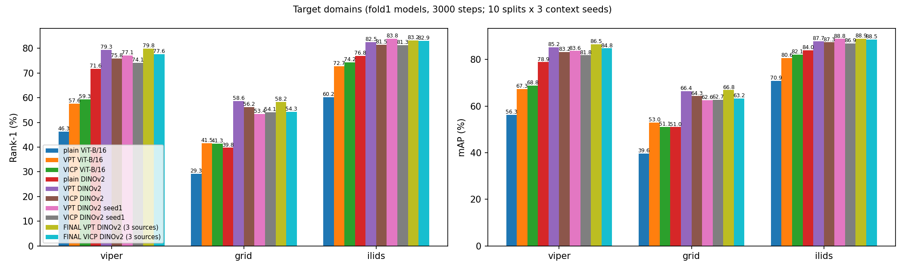
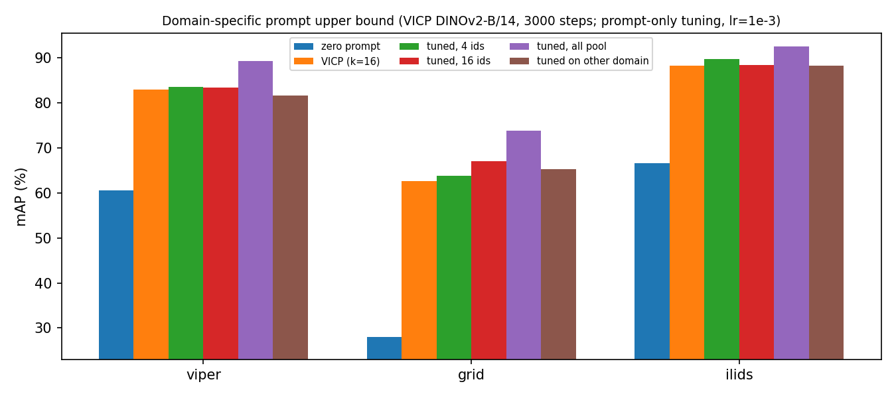
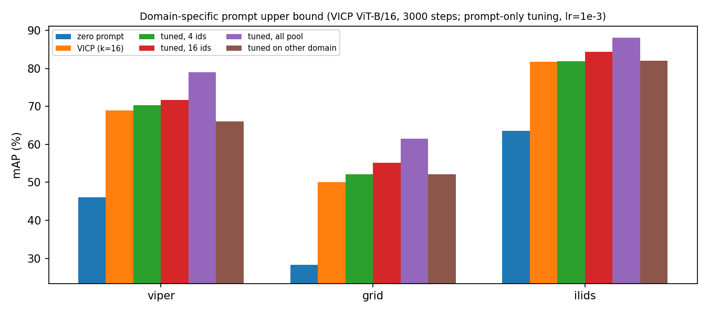
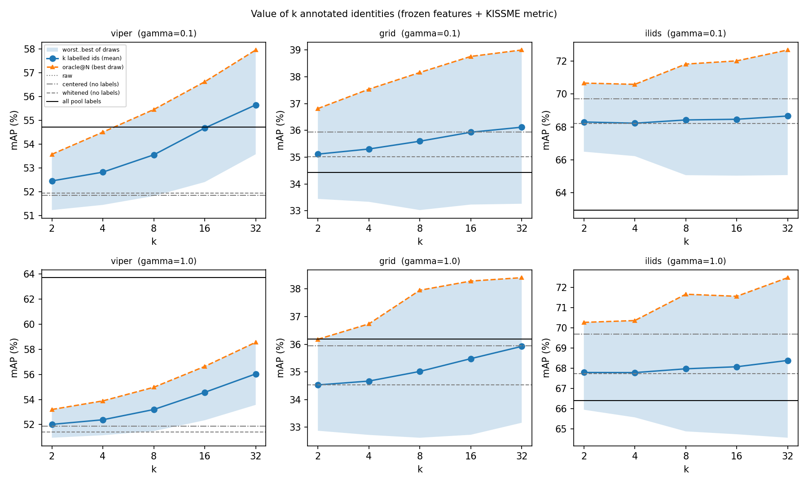
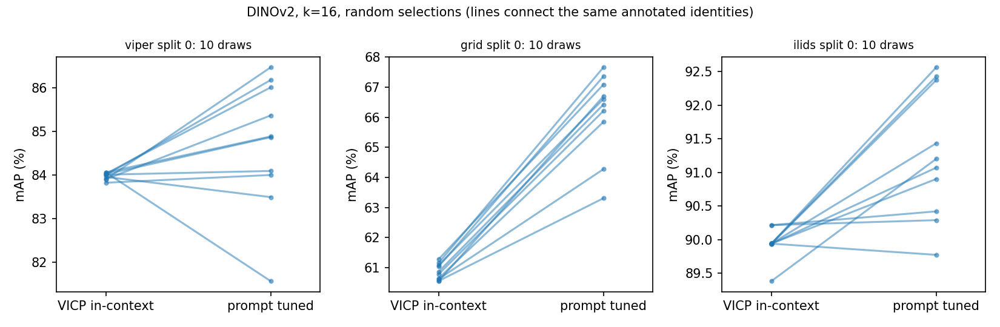
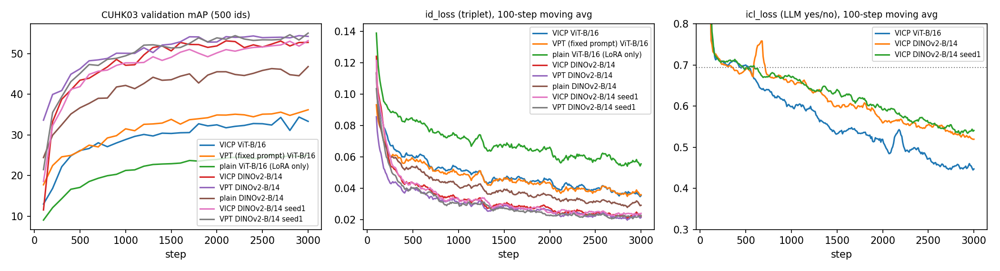

# FERReID 实验报告（2026-09-30 ~ 10-01）

> 代码：服务器 `/root/FERReID`　｜　实验输出：`/root/FERReID/experiments/`（= 数据盘 `/root/autodl-tmp/FERReID_experiments/`）
> 本报告两份：本地 `FERReID_实验报告_2026-09-30.md`（图在 `results/0930/`）；服务器 `experiments/report_0930/FERReID_实验报告_2026-09-30.md`（图在同目录）
> 全部原始数字表：`summary.md`（由 `scripts/analyze_0930.py` 自动生成）
> 队列中全部 31 个实验步骤（外加核查与前期实验）均成功完成，无失败。

---

## 0. 结论速览

| # | 结论 | 可信度 |
|---|---|---|
| 1 | **DINOv2-B/14 backbone 大幅优于 ViT-B/16**：目标域 mAP +5 ~ +14（VICP），+11 ~ +23（普通基线）。已核查数据、评测路径、泄露，未发现问题 | 高 |
| 2 | **VICP 的 LLM + 上下文对性能没有贡献**：同样 LoRA、同样 prompt 位置、同样损失，只用一个固定可学习 prompt（VPT）的效果 ≥ VICP（DINOv2 上 2 个种子 + 最终模型，9 组对比中 8 组 VPT 更好，平均 +1 ~ +2 mAP） | 高 |
| 3 | **有用的是"有一组 prompt"**：VPT 比普通基线（只有 LoRA）高 4 ~ 15 mAP | 高 |
| 4 | **域专属 prompt 的上限很大**：冻结模型只调 prompt，用目标域全部候选人的标签可 +4 ~ +16 mAP；别的域调出的 prompt 没用甚至有害 → 这部分收益确实是域专属的 | 高（上限）|
| 5 | **LLM 读了上下文，但信息在 `prompt_mlp` 处被压缩**：LLM 隐状态随上下文的相对波动 0.19 ~ 0.22，经 `prompt_mlp` 后只剩 0.06 | 中 |
| 6 | **少量标注（k=16）直接调 prompt 有小幅收益**：DINOv2 上目标域 +0.1 ~ +4.4 mAP（GRID 最明显）；但在验证域 CUHK03 上只有 +0.7 ~ +1.2 | 中 |
| 7 | **在"调 prompt"这个生成器下，选哪 16 个人确实有影响**：组间标准差 1.1 ~ 2.0 mAP，是"固定同一组人、只换随机种子"噪声（0.4 ~ 0.8）的 2 ~ 3 倍；最好−平均 ≈ 1.7 ~ 2.7，平均−最差 ≈ 2.2 ~ 3.9。而 VICP 对选人完全不敏感（标准差 < 0.5） | 中（split 少）|
| 8 | 用冻结特征 + KISSME 度量来利用标注基本无效（只有 VIPeR 有收益），不能作为 B 的载体 | 高 |

**对论文方向的含义**（详见 §5）：
- 原来的"在 VICP 上做选人"不成立（VICP 对上下文不敏感）。
- 但**"上下文 → 域专属 prompt"这条路本身价值很大**，VICP 只是没学会。方向 A（让生成器真正利用上下文）有明确的上限空间和诊断出的瓶颈位置。
- 方向 B 在一个"真正用标注"的生成器（调 prompt）上有信号，但幅度约 2 ~ 4 mAP，需要更多 split 确认。
- **后续所有实验应换到 DINOv2 backbone。**

---

## 1. 今天要回答的问题

上一轮（9/26 ~ 9/27）发现：VICP 生成的 prompt 几乎不随上下文变化（余弦 ≈ 0.99），所以"选哪 k 个人"没有意义。今天用一组便宜的实验回答：

1. 域专属 prompt 到底值不值钱？（如果值钱，说明问题在生成器；如果不值钱，修生成器也没用）
2. LLM 和上下文对 VICP 的性能有没有贡献？（VPT 对照）
3. 如果换一个一定会用标注的生成器，选人有多大影响？（方向 B 的核心）
4. 原版 VICP 的 backbone（DINOv2）适配到行人后表现如何？（用户要求）

---

## 2. 代码改动

改前备份：`/root/autodl-tmp/FERReID_backup/before_dinov2_vpt/`（adapters、scripts、models.py），`.../before_final_nonval/`（trainer_reid.py、prompt_select.py）。

### 2.1 Backbone 可配置（DINOv2 适配）

- `adapters/config_reid.py` 新增 `DEFAULT_BACKBONE = "vit_b16"` 和 `BACKBONES` 表：
  - `vit_b16`：timm ViT-B/16（augreg2 in21k→in1k），256×128，16×8 个 patch（原有，保持不变）
  - `dinov2_b14`：DINOv2 ViT-B/14（原版 VICP 的 backbone），**252×126 = 18×9 个 patch**
- `adapters/args_reid.py` 新增 `--backbone`（空 = 默认 vit_b16）。
- `adapters/reid_model.py` 新增 `Dinov2Wrapper`、`load_backbone()`、`backbone_name()`；`ReIDModel._load_dinov2` 改为按配置加载。encoder 和出题用的 encoder_copy 都换成同一个 backbone（与原版一致）。
- **DINOv2 的适配方式**（参考行人 ReID 通用做法：TransReID、PersonViT、CLIP-ReID 等均用 256×128 竖图 + 位置编码插值 + CLS 特征）：
  - patch 14 要求边长为 14 的倍数，256×128 不行 → 在**模型内部**把输入缩放到 252×126（最接近 2:1），数据管线不变，所有脚本通用；
  - 位置编码由 DINOv2 自带的插值从 37×37 插到 18×9；
  - 取 `x_norm_clstoken` 作为特征；最后 4 层 qkv 加 LoRA（与 ViT 版相同）。
  - 9/26 的零样本对比已显示 252×126 优于 224×112（VIPeR mAP 11.0 vs 7.0）。
- 兼容性：旧的 ViT-B/16 checkpoint 加载后 missing / unexpected 均为 0。

### 2.2 VPT 对照模型

`adapters/baseline_model.py::VPTReIDModel`（`--model_type vpt`）：与 VICP **完全相同**的 backbone、LoRA（r=128，最后 4 层）、prompt 插入方式（每层 32 个，12 层）、损失（triplet + 0.01×WPA），唯一区别是 prompt 来自**一个固定的可学习参数**（零初始化，与 VICP 的 `prompt_mlp` 零初始化起点相同），不用 LLM、不看上下文。可训练参数 2.65M（LoRA 2.36M + prompt 0.29M），VICP 为 37.95M。

### 2.3 其他

- `--val_domains none`：允许不设验证域（用全部三个源域训练最终模型）。
- 新脚本：
  - `scripts/oracle_prompt.py`：冻结模型只优化 prompt（域专属 prompt 上限）+ 交叉域对照 + LLM 隐状态 h 与 prompt 的余弦分析
  - `scripts/label_value.py`：冻结特征 + KISSME 度量，测 k 个标注的价值与选人差距
  - `scripts/prompt_select.py`：同一组选人下，VICP 直接生成 vs 调 prompt，测选人敏感性；`--selection_seed` 固定选人做噪声对照
  - `scripts/analyze_0930.py`：汇总所有表格和图
  - 运行脚本：`scripts/run_queue_0930.sh`、`run_queue2_0930.sh`、`run_queue3_0930.sh`、`run_queue4_0930.sh`、`run_sanity_0930.sh`、`run_oracle.sh`、`run_label_value.sh`

---

## 3. 实验设置（公共部分）

- **fold1**：源域 Market1501 + MSMT17（全部图片，5602 人），验证域 CUHK03-NP（训练中每 100 步验证，抽 500 个测试人），目标域 VIPeR / GRID / i-LIDS（PRID 缺数据）。
- 训练：3000 步，batch 64 人 × 2 图，lr 1e-4 恒定，Adam，wd 0，不裁剪梯度，fp16，seed 42（种子复现实验用 seed 1），L=64。
- 目标域评测：10 个 split，random 选 16 人当上下文，3 个上下文种子，torchreid 标准协议。
- "最终模型"：源域 Market + MSMT + CUHK03 全部图片，无验证域，其余同上。

---

## 4. 结果

### 4.1 目标域主结果



**图 4**：所有 3000 步模型在三个目标域上的 Rank-1（左）和 mAP（右），10 个 split 平均。

| 模型 | VIPeR R1 / mAP | GRID R1 / mAP | i-LIDS R1 / mAP |
|---|---|---|---|
| 普通基线 ViT-B/16（只有 LoRA） | 46.3 / 56.3 | 29.3 / 39.6 | 60.2 / 70.9 |
| VPT ViT-B/16 | 57.6 / 67.3 | 41.5 / 53.0 | 72.7 / 80.6 |
| VICP ViT-B/16 | 59.3 / 68.8 | 41.3 / 51.1 | 74.2 / 82.1 |
| 普通基线 DINOv2 | 71.6 / 78.9 | 39.8 / 51.0 | 76.8 / 84.0 |
| **VPT DINOv2** | **79.3 / 85.2** | **58.6 / 66.4** | 82.5 / 87.7 |
| VICP DINOv2 | 75.8 / 83.2 | 56.2 / 64.3 | 81.5 / 87.3 |
| VPT DINOv2（seed 1） | 77.1 / 83.6 | 53.4 / 62.6 | **83.8 / 88.8** |
| VICP DINOv2（seed 1） | 74.1 / 81.8 | 54.1 / 62.7 | 81.3 / 86.9 |
| **最终 VPT DINOv2（3 源域）** | **79.8 / 86.5** | **58.2 / 66.8** | 83.2 / **88.9** |
| 最终 VICP DINOv2（3 源域） | 77.6 / 84.8 | 54.3 / 63.2 | 82.9 / 88.5 |

VICP 在不同上下文种子之间的标准差只有 0.02 ~ 0.20 mAP（VPT 和普通基线不用上下文，标准差为 0）。

**读图要点**：
- **backbone 是最大的因素**：同为 VICP，DINOv2 比 ViT 高 +14.4 / +13.2 / +5.2 mAP；同为普通基线，高 +22.6 / +11.4 / +13.1。
- **prompt 很有用**：VPT 比普通基线高：ViT +11.0 / +13.4 / +9.7；DINOv2 +6.4 / +15.4 / +3.8（GRID 最受益）。
- **加入第三个源域（CUHK03）收益很小**：最终模型比 fold1 高约 0 ~ 1.6 mAP（VICP 在 GRID 上还低了 1.1）。

### 4.2 LLM + 上下文有没有贡献：VPT vs VICP

VPT − VICP 的 mAP 差：

| 设置 | VIPeR | GRID | i-LIDS |
|---|---|---|---|
| ViT-B/16 | −1.4 | +1.9 | −1.5 |
| DINOv2 seed 42 | +2.0 | +2.1 | +0.4 |
| DINOv2 seed 1 | +1.8 | −0.1 | +1.9 |
| DINOv2 最终模型 | +1.8 | +3.6 | +0.3 |

- **训练噪声**：同一设置换种子，目标域 mAP 差 0.4 ~ 3.9（VICP DINOv2：1.4 / 1.6 / 0.4；VPT DINOv2：1.6 / 3.9 / 1.1）。
- **CUHK03 验证**（fold1，最后一步 mAP）：VICP 52.8 / 53.2（两个种子）vs VPT 54.3 / 55.1；ViT：VICP 33.3 vs VPT 36.2。

**结论**：在 DINOv2 上，VPT 在 9 组对比中有 8 组 ≥ VICP，平均高 1 ~ 2 mAP；在 ViT 上互有胜负。**没有任何证据表明 LLM 读上下文带来了收益。**VICP 的收益来自"多了一组可学习的 prompt"。另外 VPT 训练只要 VICP 的一半时间（DINOv2：约 19 分钟 vs 39 分钟），可训练参数少 14 倍。

### 4.3 DINOv2 结果的核查

用户质疑"为什么好这么多"，逐项核查：

| 检查项 | 结果 |
|---|---|
| 两次训练的数据 | ✅ 完全相同：Market 1501 人 / 29419 张 + MSMT17 4101 人 / 126441 张，共 5602 人 |
| 评测代码 | ✅ 同一套 `run_eval` + torchreid `evaluate_rank`，只有 `--backbone` 参数不同 |
| 验证用的 500 人子集是否偏易 | ✅ 完整 700 人 CUHK03-NP 测试集：DINOv2 **47.1** vs ViT **29.0**（普通基线 ViT 21.2），差距仍为 18 点。500 人子集使两边都高 4 ~ 6 点 |
| 评测路径是否正确 | ✅ 同一路径跑 VIPeR 零样本，与 9/26 独立脚本结果吻合：ViT 12.30（旧 12.2），DINOv2 10.98（旧 11.0） |
| 预训练是否见过这些数据 | ✅ 无泄露迹象：DINOv2 零样本**不比** ViT 强（VIPeR 11.0 vs 12.3；CUHK03 完整测试集 0.20 vs 0.58，两者都接近随机水平 ≈ 0.2 ~ 0.5） |
| 训练曲线形状 | ✅ 正常：第 100 步 DINOv2 反而更低（11.5 vs 13.0），第 200 步起拉开（33.3 vs 16.8） |
| 目标域是否一致 | ✅ 三个从未见过的目标域都大幅领先（§4.1） |

**解释（推测，未验证）**：零样本时两者相当，训练后差距大 → 差别在于**轻量微调下的可塑性**，不在原始特征强弱。DINOv2 自监督学到的是局部 / 部件级表示，适合细粒度的个体区分；ImageNet 监督 ViT 的 CLS 以"类别"信息为主。

**更正**：9/26 根据零样本对比做出的"不换回 DINOv2"的决定是错的——零样本强弱不能预测微调后的表现。

### 4.4 域专属 prompt 的上限（oracle prompt）

**方法**：冻结训练好的模型全部参数（backbone、LoRA、LLM、Q-Former），以 VICP 生成的 prompt 为初值，**只优化 prompt 张量**（12 层 × 32 × 768），用训练时的 triplet 损失，300 步；训练数据为目标域候选池（train split），**评测在不重叠的 query/gallery 人上**。3 个 split 平均。




**图 1**：各条件下的 mAP。"tuned on other domain"为另外两个域调出的 prompt 的平均。上：DINOv2（lr 1e-3）；下：ViT（lr 1e-3）。ViT lr 1e-2 的版本见 `fig1_oracle_prompt_vit_lr1e-2.png`。

| mAP | ViT VIPeR | ViT GRID | ViT i-LIDS | DINOv2 VIPeR | DINOv2 GRID | DINOv2 i-LIDS |
|---|---|---|---|---|---|---|
| 全零 prompt | 46.1 | 28.4 | 63.6 | 60.6 | 28.0 | 66.7 |
| VICP prompt（k=16） | 69.0 | 50.1 | 81.7 | 83.0 | 62.7 | 88.3 |
| 用 4 人调 | 70.3 | 52.1 | 81.9 | 83.6 | 63.8 | 89.8 |
| 用 16 人调 | 71.6 | 55.1 | 84.3 | 83.4 | 67.1 | 88.4 |
| **用全部候选人调** | **79.0（+10.0）** | **61.4（+11.4）** | **88.1（+6.4）** | **89.4（+6.4）** | **73.8（+11.1）** | **92.5（+4.3）** |
| 别的域调的 prompt | 62.9 / 69.1 | 51.7 / 52.4 | 82.5 / 81.5 | 80.7 / 82.5 | 64.4 / 66.2 | 88.3 / 88.3 |
| ViT，lr 1e-2，全部候选人 | 84.6（+15.6） | 64.5（+14.4） | 84.3（+2.6） | | | |

候选池人数：VIPeR 316、GRID 125、i-LIDS 59。

**要点**：
- **上限很大**：只改 prompt，ViT 上 +6 ~ +16，DINOv2 上 +4 ~ +11。
- **确实是域专属的**：别的域调出的 prompt 基本不带来提升，ViT 上还会下降（VIPeR 用 GRID 的 prompt：69.0 → 62.9；lr 1e-2 时下降 7 ~ 19 点）。DINOv2 上 GRID 用别的域的 prompt 有 +1.7 ~ +3.5，说明其中有一部分是通用改进。
- **少量标注的收益小得多**：16 人时 DINOv2 只有 GRID +4.4，其余 < 1.5；lr 1e-2 时 4 人 / 16 人会过拟合，比 VICP 还差。
- **注意**：+10 这个数字用的是候选池全部标签（相当于用目标域一半的数据做有监督微调，只是参数只有 prompt），不是少样本场景。现实的少样本收益见 §4.6、§4.7。

**信息断在哪一环**（每域 4 组随机上下文，split 0）：

| | ViT：同域 / 跨域余弦 | ViT：相对波动 | DINOv2：同域 / 跨域余弦 | DINOv2：相对波动 |
|---|---|---|---|---|
| LLM 隐状态 h（`prompt_mlp` 之前） | 0.978 / 0.963 | 0.186 | 0.964 / 0.937 | 0.216 |
| 最终 prompt（`prompt_mlp` 之后） | 0.997 / 0.995 | 0.065 | 0.998 / 0.996 | 0.061 |

→ LLM 的输出是随上下文变化的（跨域时变得更多），但经过 `prompt_mlp` 后变化被压缩到约 1/3。瓶颈至少有一部分在这层映射（零初始化、无约束的线性层，训练中没有任何压力让它保留上下文信息）。

### 4.5 标注价值：冻结特征 + KISSME 度量（方向 B 的第一个载体，失败）

**方法**：普通基线 ViT（1000 步）冻结特征；用 k 个人的跨摄像头正样本对估计类内协方差，无标签候选池估计总体协方差，构成 KISSME 马氏度量（收缩系数 γ 取 0.1 / 1.0，事先固定）。每个 k 抽 30 组，10 个 split。



**图 2**：蓝线 = k 个标注人的平均；阴影 = 30 组中最差到最好；橙色虚线 = 最好一组（oracle@30）；灰线为无标签对照；黑线 = 用全部候选人标签。

| mAP | VIPeR | GRID | i-LIDS |
|---|---|---|---|
| 原始特征 | 51.9 | 35.9 | 69.7 |
| 无标签白化（γ=1） | 51.4 | 34.5 | 67.7 |
| k=16（γ=0.1），平均 | 54.7 | 35.9 | 68.5 |
| k=16，最好−平均 / 平均−最差 | 2.0 / 2.3 | 2.8 / 2.7 | 3.5 / 3.4 |
| 全部候选人标签（γ=1） | 63.7 | 36.2 | 66.4 |

**结论**：只有 VIPeR（2 个摄像头，跨摄像头变化规律）受益；GRID 无变化，i-LIDS 反而下降。线性度量利用标注的能力太弱，**不能作为方向 B 的载体**。
**脚本问题**：图中"centered"条件在构造上等于原始特征（欧氏距离对平移不变），没有信息量，可以忽略。

### 4.6 选人敏感性（方向 B 的核心）

**方法**：对同一组选中的 k 个人，比较两种生成器——(a) VICP 直接用上下文生成 prompt；(b) 以 (a) 为初值，用这 k 对图调 prompt（lr 1e-3，300 步）。每组选人不同，组间差异 = 选人的影响 + 生成器自身的随机性。**噪声对照**：固定同一组人（selection_seed=5），只换出题 / 调参的随机种子，组间差异 = 纯噪声。



**图 5**：DINOv2，k=16，split 0 的 10 组随机选人。每条线连接同一组人在两种生成器下的 mAP。左端几乎重合（VICP 对选人不敏感），右端明显散开。其他版本：`fig5_selection_dinov2_k16_noise.png`（固定选人）、`fig5_selection_dinov2_k4.png`、`fig5_selection_vit_k16.png`、`fig5_selection_vit_k16_noise.png`。

组间标准差（mAP）：

| | VIPeR | GRID | i-LIDS |
|---|---|---|---|
| VICP 直接生成（任一设置） | 0.1 ~ 0.2 | 0.2 ~ 0.3 | 0.2 ~ 0.4 |
| DINOv2 调 prompt，随机选人（k=16，3 split） | 1.14 | 1.52 | 1.95 |
| DINOv2 调 prompt，**固定选人（噪声）** | 0.39 | 0.55 | 0.81 |
| → 估计的选人贡献 √(总² − 噪声²) | ≈1.07 | ≈1.42 | ≈1.77 |
| DINOv2 调 prompt，随机选人（k=4，1 split） | 0.86 | 1.06 | 1.08 |
| ViT 调 prompt，随机选人（k=16，1 split） | 0.39 | 2.09 | 4.22 |
| ViT 调 prompt，固定选人（噪声） | 0.62 | 0.79 | 0.92 |

DINOv2 k=16 调 prompt 的"最好−平均 / 平均−最差"：VIPeR 1.8 / 2.2，GRID 1.7 / 3.3，i-LIDS 2.7 / 3.9（3 个 split 平均）。

**结论**：
- 用一个**真正使用标注**的生成器时，选人的影响**明显大于噪声**（2 ~ 3 倍），GRID、i-LIDS 更明显；VIPeR（只有 2 个摄像头、每人 1 对图）在 ViT 上没有选人效应。
- 可争取的幅度：理想选择器比随机平均高约 2 mAP，避免最差选择约 2 ~ 4 mAP。
- k=4 时组间差异反而更小（调 prompt 本身收益也更小）。
- **局限**：噪声对照只做了 split 0 的一组人；随机选人只有 10 组、1 ~ 3 个 split。

### 4.7 少样本调 prompt 的学习率（在验证域上选）

为避免在测试集上挑超参，在验证域 CUHK03（DINOv2 fold1 模型，5 组随机选人）上比较：

| lr | k | VICP mAP | 调后 mAP | 提升 | 组间 std |
|---|---|---|---|---|---|
| 3e-4 | 4 | 47.2 | 47.2 | +0.05 | 0.40 |
| **3e-4** | **16** | 47.1 | 48.3 | **+1.15** | 0.68 |
| 1e-3 | 4 | 47.2 | 46.6 | −0.60 | 1.27 |
| 1e-3 | 16 | 47.1 | 47.9 | +0.73 | 1.18 |
| 3e-3 | 4 | 47.2 | 45.9 | −1.30 | 1.48 |
| 3e-3 | 16 | 47.1 | 47.3 | +0.15 | 1.15 |

**结论**：验证域上最佳为 lr 3e-4，而且在 CUHK03 上少样本调 prompt 的收益很小（≤ +1.2）；k=4 时基本无益甚至有害。目标域实验用的 lr 1e-3 是事先定的（不是在测试集上挑的），但验证域结果提示它可能偏大。**不同域上少样本调 prompt 的收益差别很大**（GRID +4.4，CUHK03 +0.7）。

### 4.8 训练曲线



**图 3**：左：CUHK03 验证 mAP；中：id_loss（triplet）；右：icl_loss（LLM 答 yes/no，虚线为 ln2 = 瞎猜）。

- 验证 mAP 明显分成两组：DINOv2（45 ~ 55）远高于 ViT（25 ~ 36）；每组内 VPT ≥ VICP > 普通基线。
- id_loss：DINOv2 各模型最低（≈0.022），普通基线最高。
- icl_loss：DINOv2 版（0.52 ~ 0.54）反而比 ViT 版（0.45）高。→ DINOv2 的提升不是因为 LLM 答题更好，而是 backbone 本身。3000 步时所有曲线仍在缓慢改善。

---

## 5. 对论文方向的影响

| 问题 | 结果 | 含义 |
|---|---|---|
| 域专属 prompt 值不值钱？ | 上限 +4 ~ +16 mAP，且确实依赖域 | **值钱**。不是"修也没用" |
| VICP 拿到这部分收益了吗？ | 没有，VPT ≥ VICP | VICP 的上下文通路没起作用；现有 VICP 上做选人不成立 |
| 瓶颈在哪？ | LLM 读了上下文，h 随上下文变化；`prompt_mlp` 后被压缩到约 1/3；训练目标也没有要求 prompt 依赖上下文 | 方向 A 有具体的修复切入点 |
| 用真正使用标注的生成器，选人有用吗？ | 调 prompt 时选人效应 ≈ 1 ~ 2 mAP 标准差，是噪声的 2 ~ 3 倍 | 方向 B 有信号，但幅度中等 |
| backbone？ | DINOv2 远好于 ViT | 后续全部换 DINOv2 |

**两个可行的论文故事**：
1. **A + B 组合（推荐评估）**："in-context ReID 的上下文通路失效"（VPT ≥ VICP、prompt 近似常量，有诊断证据）→ 提出让生成器真正利用上下文的修复（目标：用 k 个标注人不求梯度就接近"调 prompt"的效果）→ 在修好的生成器上做选人。风险：修复不一定成功，时间紧。
2. **B 为主**：以"用 k 个标注人调 prompt / 生成 prompt"为载体研究选人，VICP 的失效作为动机。风险：选人收益约 2 mAP，偏小；少样本调 prompt 要更新参数，与"测试时不更新参数"的设定不同，需要重新表述（例如"少量标注下的测试时适应"）。

---

## 6. 局限与注意事项

- 多数分析实验只有 1 ~ 3 个 split、10 组抽样；选人结论需要扩大到 10 个 split 确认。
- oracle prompt 的"全部候选人"用了大量标注，不是少样本场景，不能直接作为方法收益。
- 调 prompt 的超参在目标域上用了事先定的 lr 1e-3；验证域显示 3e-4 更好，目标域数字可能有偏差（方向不确定）。
- 训练噪声：同设置换种子，目标域 mAP 差最多约 3.9（GRID），比较时要考虑。
- VPT vs VICP 在 ViT 上互有胜负；"VPT 更好"的结论主要来自 DINOv2（2 个种子 + 最终模型）。
- `label_value` 中"centered"条件无效（见 §4.5）。
- 所有模型都是 3000 步，曲线仍未完全收敛。
- i-LIDS 没有真实摄像头信息（camid 是图片序号），"跨摄像头正样本对"在 i-LIDS 上只是"不同的两张图"。

---

## 7. 建议的下一步

1. **全部切换到 DINOv2**，重新确定训练步数（3000 步未收敛，可试 5000）。
2. **选人敏感性扩大到 10 个 split**，使用 CUHK03 上选出的 lr 3e-4，并对每个 split 做噪声对照。约 3 小时。
3. **方向 A 的最小修复实验**：
   - (a) `prompt_mlp` 改为残差 / 带归一化的映射，或直接把 h 的变化分量放大，看 prompt 是否开始依赖上下文；
   - (b) episode 式训练：上下文的人 ≠ 被检索的人，并按摄像头把源域拆成约 30 个"伪域"；
   - (c) 判据：本域上下文生成的 prompt 在目标域上**明显好过** VPT 的固定 prompt。
4. 选择方法的第一版可以从"风格 / 摄像头覆盖"与"难负样本"两个信号入手，先用 `prompt_select.csv` 里记录的每组 pid 做相关分析（无需 GPU）。
5. 相关工作查新：少样本测试时 prompt 调整（test-time prompt tuning）在 ReID 上的已有工作。

---

## 附：关键路径

| 内容 | 路径（服务器 `/root/FERReID/experiments/`） |
|---|---|
| 训练（fold1，3000 步） | `cv_fold1_3k/`（VICP ViT），`vpt_fold1_3k/`，`plain_fold1_3k/`，`dinov2_fold1_3k/`，`vpt_dinov2_fold1_3k/`，`plain_dinov2_fold1_3k/`，`dinov2_fold1_3k_s1/`，`vpt_dinov2_fold1_3k_s1/`（各含 `val_cuhk03/checkpoint-3000`） |
| 最终模型（3 源域） | `final_vicp_dinov2_all/checkpoint-3000`，`final_vpt_dinov2_all/checkpoint-3000` |
| 目标域评测 | `eval3k/*/context_eval.csv`，`eval_final/*/context_eval.csv` |
| Oracle prompt | `oracle_prompt/lr1e-3/`，`oracle_prompt/lr1e-2/`，`oracle_prompt_dinov2/lr1e-3/` |
| 标注价值 | `label_value/`（含每个 split 的特征 `feats_*.npz`） |
| 选人敏感性 | `prompt_select/`（ViT k16），`prompt_select_noise_vit/`，`prompt_select_dinov2/k16/`，`prompt_select_dinov2/k4/`，`prompt_select_noise_dinov2/`（csv 中记录了每组的 pid） |
| lr 选择 | `lr_select_cuhk03/lr*_k*/` |
| 核查 | `sanity_0930/` |
| 队列日志 | `queue_0930.log` |
| 图与汇总 | `report_0930/`（fig1 ~ fig5、`summary.md`、本报告） |

评测命令示例（最终 VPT DINOv2）：
```bash
cd /root/FERReID
python scripts/eval_context.py --output_dir experiments/eval_final/vpt_dinov2 \
  --checkpoint experiments/final_vpt_dinov2_all/checkpoint-3000 --model_type vpt --backbone dinov2_b14 \
  --methods random --ks 16 --eval_seeds 3 --eval_splits 10 --num_icl_samples 64 --fp16 True --report_to none
```
